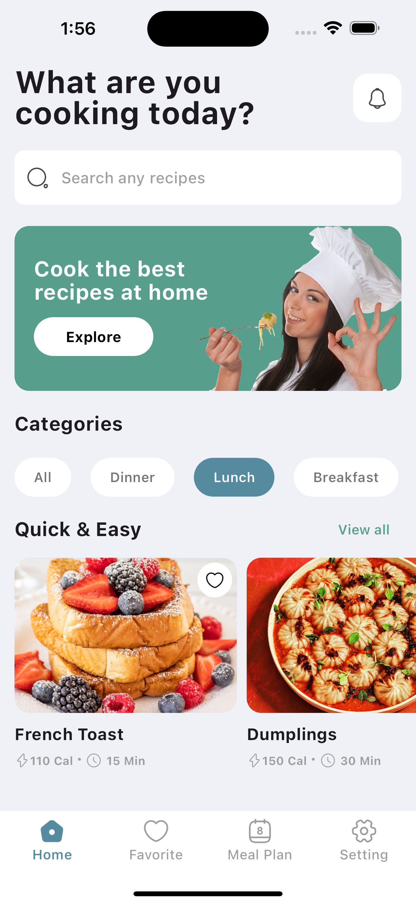
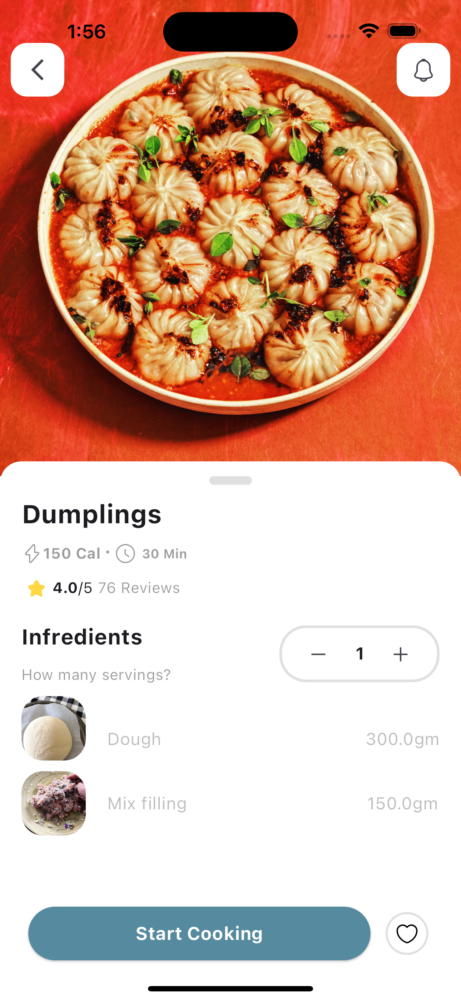
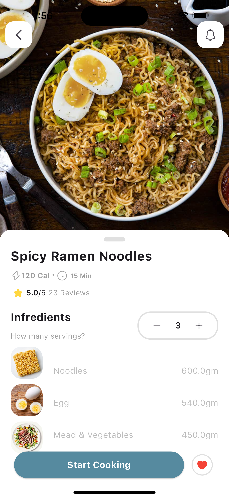
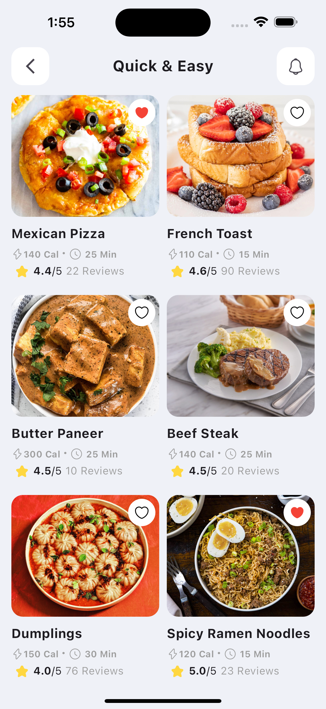
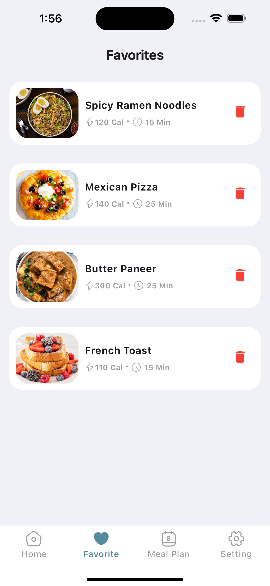

# Complete Source Code
Recipe App: https://buymeacoffee.com/wtfcode/e/363149

# Recipe App
In this Project, we'll walk you through creating a complete Flutter app from start to finish using Flutter Firebase and the Provider state management. We'll be building a fully functional recipe app that integrates Firebase as the backend for data storage and uses Provider to manage app state efficiently. This Flutter crash course is perfect for developers looking to understand how to build a Flutter app with a backend using Firebase and Provider for seamless state management. Whether you're a beginner or an experienced developer, this complete Flutter app project will guide you step-by-step through the development process, making it easy to build your own Flutter app with Firebase and Provider

## Screenshot

      

